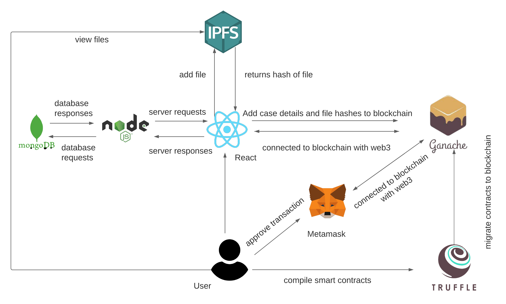
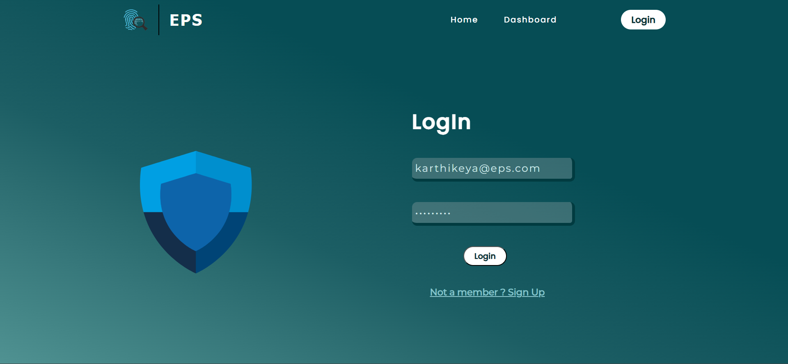
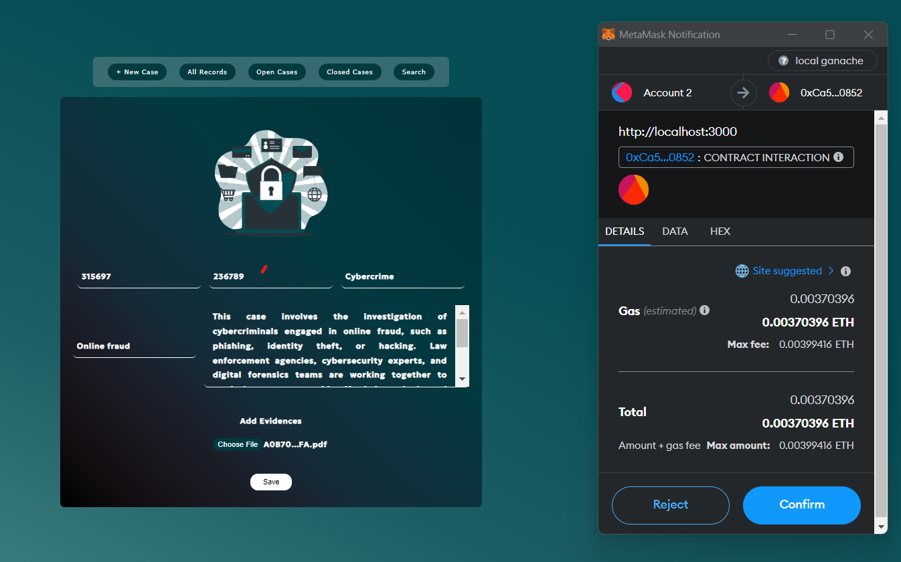
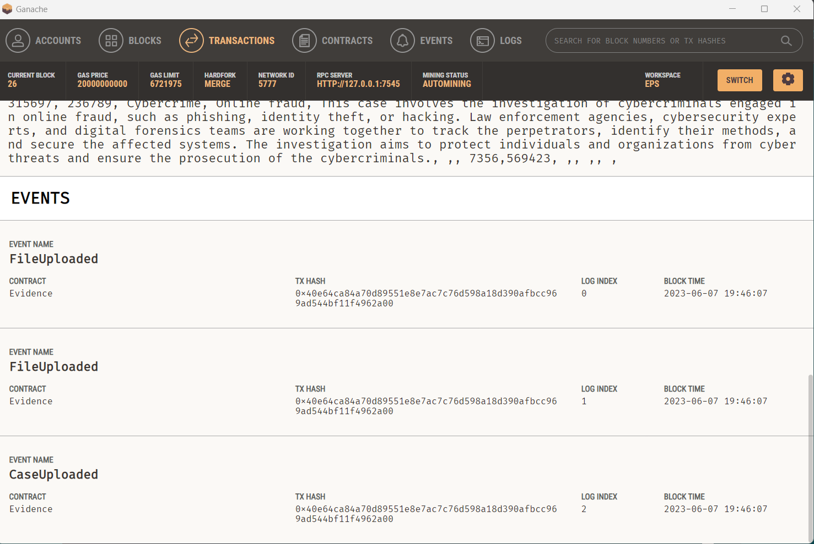
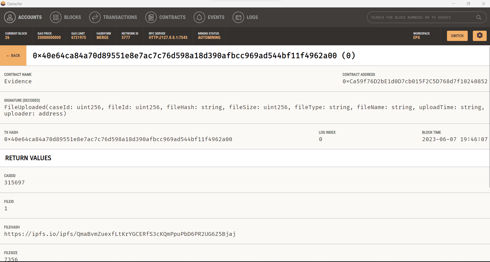
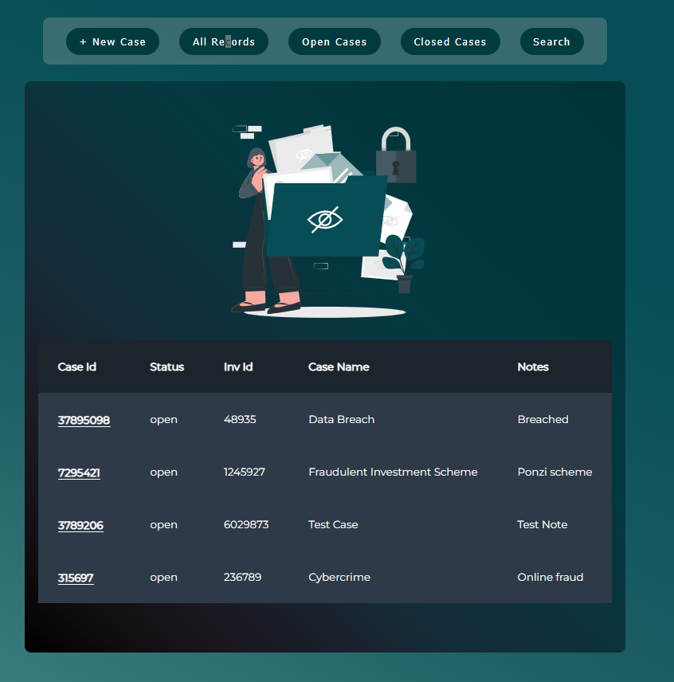
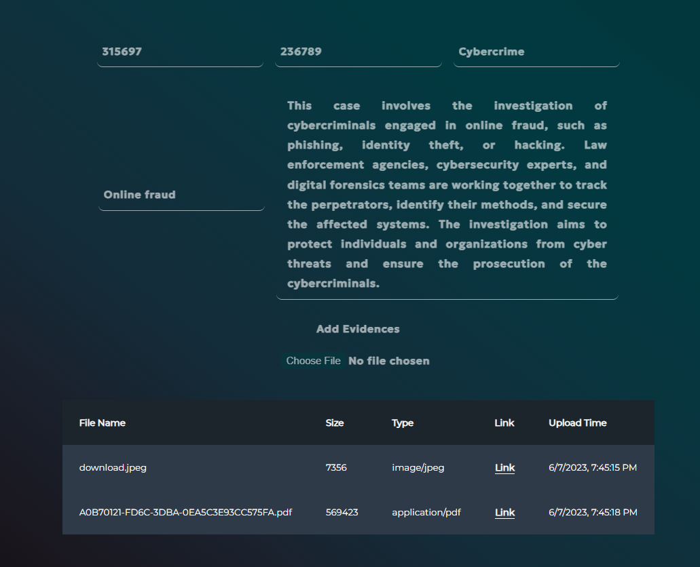
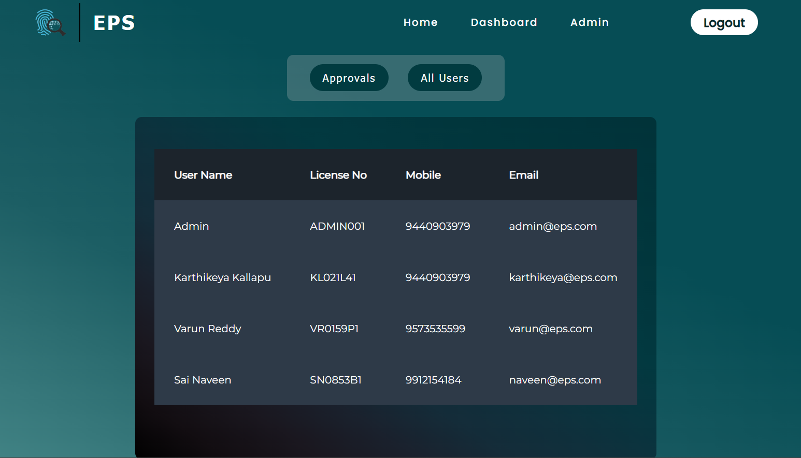

# Evidence Protection System 

Our project focuses on developing an evidence protection system using
blockchain technology. The increasing reliance on digital evidence across
various domains necessitates robust solutions to ensure its integrity and
prevent tampering. Traditional methods struggle to address the challenges of
security and transparency. In response, our proposed system leverages
blockchain's decentralized and transparent nature to guarantee the integrity,
immutability, and transparency of digital evidence. By implementing this
system, we can enhance security, establish immutable records, promote
transparency, facilitate efficient collaboration, and instill trust in the
authenticity of digital evidence

 
 
#### Demo Video

https://www.youtube.com/watch?v=bz_oWCcVTYQE

 
## Run Locally
 
### Setup frontend 

clone the frontend branch

```bash
  https://github.com/ikarthik21/EPS_FRONTEND.git -b frontend
``` 

Install dependencies

```bash
  npm install
```

configure the env file (sample env is given)


Start the frontend

```bash
  npm run start
```

### Setup local blockchain network (Ganache)

Dowload the ganache from  <a href="https://trufflesuite.com/ganache/">here </a>

create a new project in ganache and add the truffle config of the project.


### Install Metamask Extension 

configure the metamask

add ethers into wallet from ganache

### Setup IPFS

Dowload the IPFS from  <a href="https://github.com/ipfs/ipfs-desktop/releases">here </a>

configure the ipfs and start it.


### Setup backend 

clone the backend branch

```bash
  https://github.com/ikarthik21/EPS_Backend.git -b backend
``` 

Install dependencies

```bash
  npm install
```

configure the env file (sample env is given)

Start the server

```bash
  node server.js
```

## Screenshots








